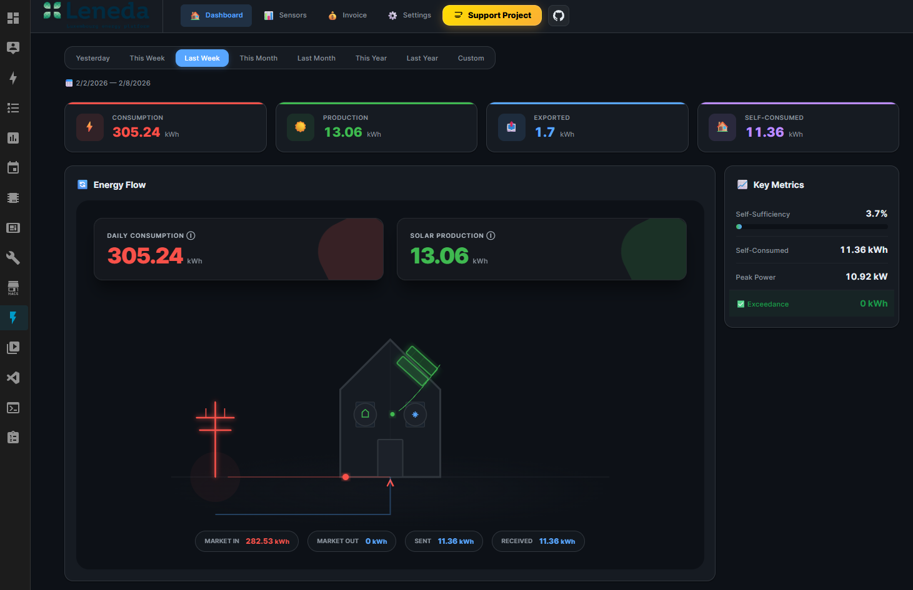
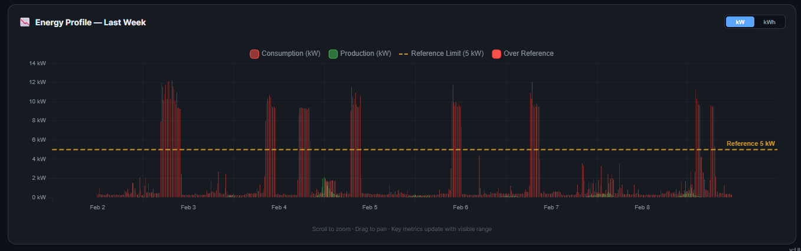
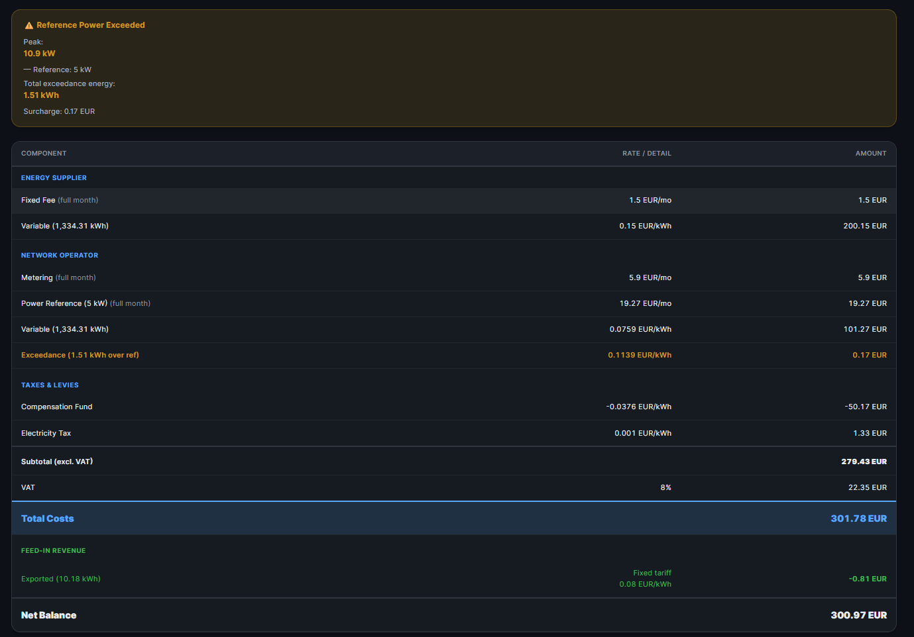
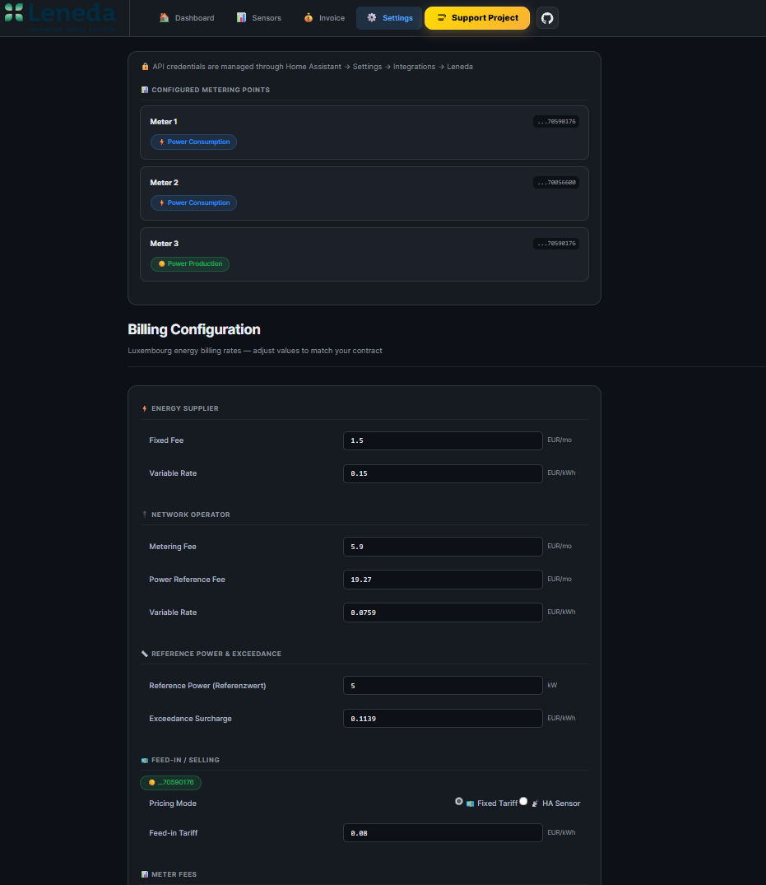

# ⚡ Leneda HACS Integration

<p align="center">
  
</p>

<p align="center">


[](https://koosoli.github.io/Leneda-integration/)
[](https://buymeacoffee.com/koosoli)
[](https://github.com/sponsors/koosoli)

</p>

> **The ultimate energy monitoring experience for Leneda smart meters in Luxembourg.**  
> Completely rewritten from the ground up to offer an "Avant-Garde" visualization, robust device consolidation, and seamless integration.

---

## 🌟 What's New in v2.0?

This isn't just an update; it's a **whole new software**:
- **🎨 Avant-Garde Dashboard**: A stunning, custom-built energy dashboard with glassmorphism, animated flows, and comprehensive stats.
- **🧩 Device Consolidation**: Automatically groups consumption, production, and gas meters into a single, logical "Leneda" device.
- **⚡ Real-Time Flow**: (Simulated) real-time animations based on your daily data to visualize energy movement.
- **🔋 Energy Community Support**: Native support for tracking shared energy within communities.
- **🛠️ Self-Repairing**: Automatically handles API outages and preserves sensor states.

---

## 🚀 Features

### 📊 Smart Energy Monitoring
- **Complete History**: Access yesterday's, last week's, and last month's data with pinpoint accuracy.
- **Gas Integration**: Full support for gas volume (m³) and energy (kWh).
- **Zero-Config Calculations**: Automatically calculates self-consumption, grid export, and community sharing without complex templates.

### 💎 The "Elite" Visual Experience
The integration includes a standalone dashboard panel that provides:
- **Interactive Graphs**: Zoomable, panning charts for granular analysis.
- **Visual Flow**: Beautifully animated energy flow diagrams.
- **Metric Insights**: Instant visibility into peak power, self-sufficiency, and costs.

---

## � Screenshots

| Dashboard | Energy Profile |
|:-:|:-:|
|  |  |

| Invoice Estimate & Exceedance Warning | Cost Settings |
|:-:|:-:|
|  |  |

---

## �📦 Installation
### Option 0: No Installation — Use it Online! 🌐
No Home Assistant? No problem. The dashboard is available as a **hosted web app**:

1. Go to **[koosoli.github.io/Leneda-HACS-integration](https://koosoli.github.io/Leneda-HACS-integration/)**.
2. Browse the dashboard with demo data right away.
3. To see **your real energy data**, open **Settings** and enter your Leneda API credentials (API Key, Energy ID, and Metering Point IDs).
4. Your credentials are stored locally in your browser — they are never sent to any third-party server.
### Option 1: HACS (Recommended)
1. Open **HACS** in Home Assistant.
2. Go to **Integrations**.
3. Click the **⋮ menu** (top right) ➜ **Custom repositories**.
4. Add this URL: `https://github.com/koosoli/Leneda-HACS-integration`
5. Category: **Integration**.
6. Find **Leneda** in the list and click **Download**.
7. Restart Home Assistant.

### Option 2: Manual
1. Download the latest release from the [Releases Page](https://github.com/koosoli/Leneda-HACS-integration/releases).
2. Extract the `custom_components/leneda` folder into your HA `config/custom_components/` directory.
3. Restart Home Assistant.

### Option 3: Local Dashboard Testing (No `.bat` files)
Run the dashboard locally without Home Assistant:

Live dev server with hot reload:
```bash
cd frontend-src
npm install
npm run dev -- --host localhost --port 5175 --strictPort --open
```

Standalone local server using the built dashboard:
```bash
cd frontend-src
npm install
npm run build
cd ../standalone
node server.js
```

In both cases, open **http://localhost:5175**.  
For the full standalone guide, see [standalone/README.md](standalone/README.md).

---

## ⚙️ Configuration

1. Go to **Settings ➜ Devices & Services**.
2. Click **+ Add Integration**.
3. Search for **Leneda**.
4. Enter your **API Key** and **Metering Point IDs** (found in the Leneda Portal).
5. (Optional) Set a **Reference Power** entity to track excess usage charges.

---

## ☕ Support the Project

If this integration makes your energy management easier (or just looks cool on your wall), consider buying me a coffee!

<a href="https://buymeacoffee.com/koosoli">
  
</a>

Or sponsor me on GitHub: [**github.com/sponsors/koosoli**](https://github.com/sponsors/koosoli)

---

## Credits
Authored by **[@koosoli](https://github.com/koosoli)**.  
